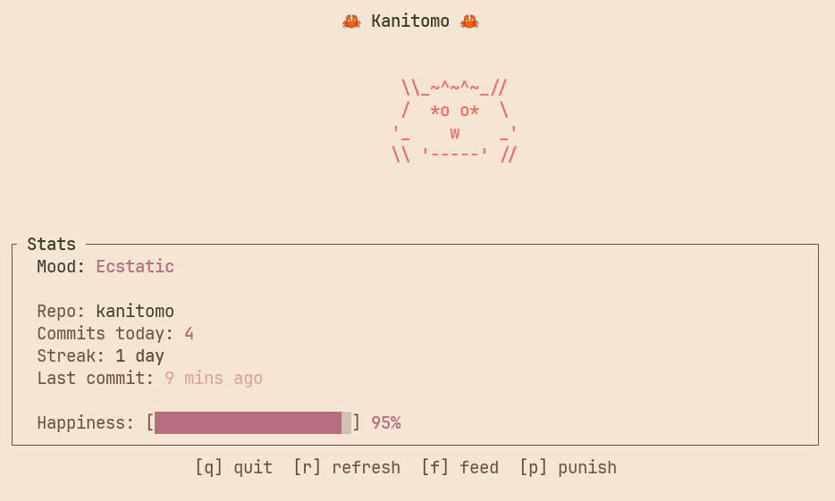

# Kanitomo

A terminal pet crab that thrives on your git commits.

## Demo



*Meet Kani, your new coding companion. Feed them commits and watch them thrive!*

## About the Name

The name "Kanitomo" is inspired by [Tamagotchi](https://en.wikipedia.org/wiki/Tamagotchi), the famous virtual pet from the 90s. "Tamagotchi" is a portmanteau of two Japanese words:
- **tamago** (卵) - egg
- **tomodachi** (友達) - friend

Following this pattern, "Kanitomo" combines:
- **kani** (蟹) - crab
- **tomo** (友) - friend

So "Kanitomo" literally means "crab friend" - your little terminal companion that keeps you company while you code.

## Features

- Watch Kani react to your git commits in real-time
- Happiness system that rewards consistent coding
- Weekends off - Kani won't get sad while you rest
- Persistent state - Kani remembers you between sessions

## Installation

```bash
cargo install --path .
```

## Usage

Run `kanitomo` in any git repository:

```bash
kanitomo
```

Kani will watch for new commits and respond with joy!

## License

MIT
